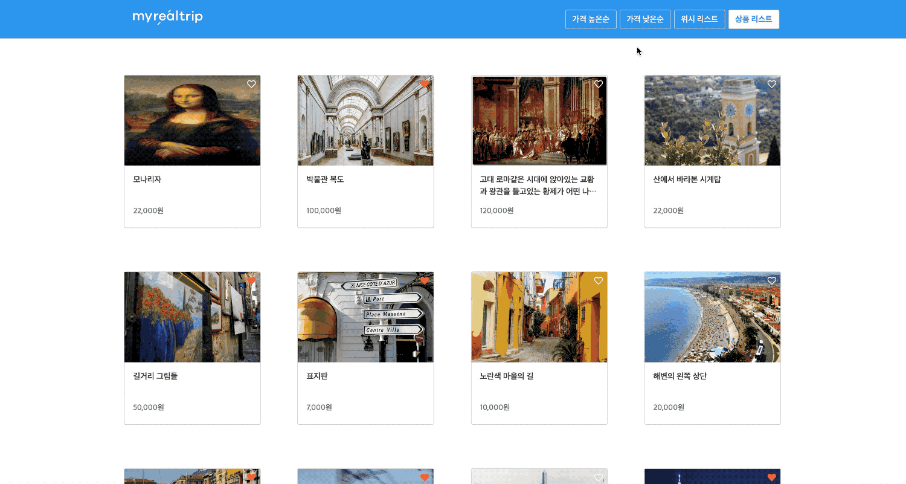

> ## Contents

- [Introduction](#Introduction)

- [Installation](#Installation)

- [Features](#Features)

- [Approach](#Approach)

- [Project Structure](#Project-Structure)

- [Learning points](#Learning-points)

> ### Introduction

- 상품의 썸네일, 제목, 가격을 한 눈에 볼 수 있는 SPA로 구성되어 있는 웹 어플리케이션.

- 가격에 따라 상품들을 정렬할 수 있고 사용자만의 위시 리스트에 상품을 보관할 수 있습니다.

- Reactive Feature

  

- Header Navigation Feature

  

- Infinite scroll feature

  

- Wish List Feature

  

> ### Installation

```
git clone https://github.com/MrKamake/myrealtrip-test.git

cd myrealtrip-test

yarn install

yarn start
```

> ### Features

- 상품 리스트(Default)를 한 페이지에 볼 수 있습니다.

- 가격에 따라 상품을 정렬할 수 있습니다.

- 사용자가 선택한 상품들을 위시 리스트에 추가/삭제할 수 있습니다.

- 사용자가 선택한 상품들은 전체 리스트에서도 확인할 수 있습니다.

- 리스트 메뉴를 변경해도 선택된 정렬에 따라 유지됩니다.

- 아래로 스크롤하면 추가적으로 상품들을 볼 수 있습니다.

> ### Approach

1. 실제 Api를 호출해서 가져오는 것과 유사하게 가상의 데이터를 만들고 로직을 구현해서 상품 리스트들을 랜더링했습니다.

2. 정렬시키는 기능은 React-Router를 활용해서 변경되는 URL의 Params를 Store에 저장해서 사용했습니다.

3. 원하는 상품을 클릭할 때, Action을 취해서 store에 이미 존재한다면 삭제를 하고 존재하지 않는다면 추가를 해주도록 구현했습니다.

4. 저장된 Wish List를 활용해서 상품들을 렌더링할때, 포함돼있는지 필터링해서 상품들을 구분했습니다.

5. 정렬의 상태도 Store에 변경할때마다 저장해두고 새로운 리스트를 렌더링할때도 적용하도록 했습니다.

6. 무한 스크롤을 만들기 위해서 React의 Lifecycle(componentDidMount, componentWillUnmount)를 사용해서 페이지(document)에 스크롤 이벤트를 추가했습니다. 그리고 사용자가 보는 페이지의 높이에 따라서 페이지 전체의 길이에 반응해서 다음 상품 데이터를 받아와서 랜더링하도록 했습니다.

> ### Project Structure

#### 1) 컴포넌트

페이지의 가장 상위 컴포넌트로 존재하는 **`<App />`** 컴포넌트와 요구 사항에 따라 **`<Header />`** 컴포넌트와 **`<List />`** 컴포넌트를 만들었습니다. 페이지가 초기 랜더링되는 상품들의 리스트와 위시 리스트를 랜더해야합니다. 그리고 가격에 따라서 상품들의 리스트업을 2번 해야합니다. 따라서 총 4개의 화면이 보여져야하는데 List 컴포넌트를 재사용할 수 있었습니다.

#### 2) React Router

구분하는 기준은 아래의 실제 코드와 함께 설명하겠습니다.

```js
// 초기 랜더링 될때 Redirect를 사용해서 Path를 "/main"으로 변경해서 명확한 주소로 사용자가 알아 볼 수 있도록 구현했습니다.
<Route exact path="/" render={() => <Redirect to="/main" />} />
<Route exact path="/main" />

// 가격에 따른 랜더링을 위해서
<Route path="/sorted-price/:selection" /> // ex) high, low

// 위시 리스트를 보여주기 위해서
<Route path="/products/:selection" /> // ex) wish
```

#### 3) Redux 활용

##### - Action types

- `GET_DATA`: 초기 랜더링 시 필요한 데이터를 받아오는 액선 타입
- `GET_HIGH_PRICE`: 가격 높은순으로 상품들을 정렬하기 위한 액선 타입
- `GET_LOW_PRICE`: 가격 낮은순으로 상품들을 정렬하기 위한 액선 타입
- `UPDATE_SORT_MESSAGE`: 가격 정렬하는 버튼의 강조를 위한 액선 타입
- `UPDATE_SELECTED_LIST_MESSAGE`: 상품 리스트 혹은 위시 리스트 버튼의 강조를 위한 액선 타입
- `UPDATE_WISH_LIST`: 사용자가 선택한 상품의 고유한 id 값을 위시 리스트에 저장하기 위한 액선 타입

##### - InitialState

```js
// 액션이 동작되면서 아래와 같은 초기 설정 state에 데이터가 저장/변경됩니다.
const initialState = {
  productList: [],
  sortMessage: '',
  selectedListMessage: '',
  wishList: []
};
```

##### - Reducer

- `getDataReducer`는 상품들의 정렬을 다루기 떄문에 `GET_DATA`, `GET_HIGH_PRICE`, `GET_LOW_PRICE` 3가지 액션 타입의 케이스에 따라 랜더링 될 상품 리스트를 반환하도록 구현했습니다.

> ### Learning Points

- **시간 관리**

  : 제한된 시간 내에 요구조건 사항들을 완성하기 위해서 마음이 급했던 것은 사실입니다. 대략적인 큰 틀의 설계를 하고 테스크를 리스트업해서 할 수 있는 작은 것부터 해결해나가면서 재미를 더욱 느꼈고 속도가 생겼습니다. 현업에서 서비스를 맡아서 일을 하게될때도 다르지 않을 것이라고 생각합니다. 이번 과제를 통해서 자신의 상태에 따른 시간 관리를 맞춰서 해야한다는 것을 배웠습니다.

- **구조 설계**

  : 위의 내용과 같이 시간 관리에 대한 아쉬움으로 인해 전체적인 구조를 설계하는 부분도 아쉬웠습니다. 과정 중 어려움에 부딪혔을때, 변경하기 쉬운 적절한 시기에 잠시 중단하고 보다 나은 설계를 생각하고 만들었습니다. 구현을 시작하기전에 더욱 깊이 고민해서 정확하고 빠른 코딩을 할 수 있다는 것을 배웠습니다.

- **git**

  : Git으로 버전 관리를 했습니다. 저의 코딩 철학은 함께 협업하는 동료들과 나를 위한 배려가 있는 코드여야 한다고 생각합니다. 개발 과정 중 커밋 메세지를 더 디테일하고 명확하게 작성하지 못한 점이 아쉬웠습니다. Git을 사용하는 것에 더 신경쓰고 싶습니다.

- **Me**

  : 현재 저의 개발속도가 빠르지는 않지만 구현해내는 코드에 집중합니다. 누가봐도 읽기 쉽게 가독성이 좋고 재사용이 가능한 코딩을 하기위해 노력하고 있습니다. 정확하지 않은 채로 빠르게 코딩한다면 더욱 돌아가는 것이라 생각합니다. 최선을 다해 속도를 내면서 보다 정확하게 프로그래밍을 하는 개발자가 될 것입니다.

> ### Thank You

마이리얼트립은 성장하는 사람들이 성과내며 일하기 좋은 회사라는 것에 매력을 더 느꼈습니다.

저는 혼자 개발을 공부하거나 Bootcamp에서 솔로 프로젝트로 개발을 해왔습니다.

이제는 마이리얼트립의 일원이 되어서 팀원들과 함께 좋은 영향을 서로 주고 받으며 성장하고 싶습니다.

감사합니다!:blush:
